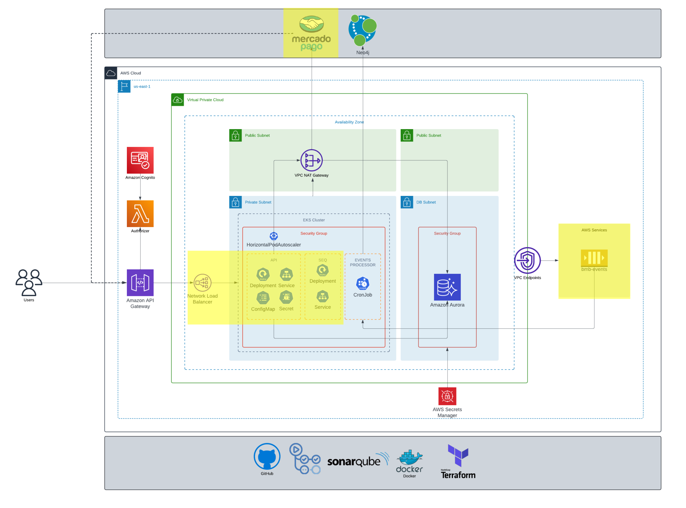

# FIAP Tech Challenge - ByteMeBurger API

[](https://github.com/soat-fiap/FIAP.TechChallenge.ByteMeBurger/actions/workflows/dotnet.yml)

[](https://sonarcloud.io/summary/new_code?id=soat-fiap_FIAP.TechChallenge.ByteMeBurger)
[](https://sonarcloud.io/summary/new_code?id=soat-fiap_FIAP.TechChallenge.ByteMeBurger)

## Description
This repository contains the source code for the ByteMeBurger API, part of the FIAP Tech Challenge. The API is designed to manage a burger restaurant's operations, including order placement, customer registration, and product management. The recent updates introduce a new endpoint for customer registration and enhance various aspects of the application, such as error handling, data models, and service configurations.

Endpoints are protected since JWT token is now required. Since this application will run on EKS Cluster inside a private VPC, Customers endpoint will be deprecated or splited into a different service. Customers information can be extracted from token, since it's generated and validated internally.

## Tech challenge deliverables
- You can find all Phase 1 deliverables on the [Wiki page](https://github.com/soat-fiap/FIAP.TechChallenge.ByteMeBurger/wiki)
- Phase 2 Deliverables
   - [Business requirements](https://github.com/soat-fiap/FIAP.TechChallenge.ByteMeBurger/wiki/Business-Requirements-Document)
   - [Infrastructure](https://github.com/soat-fiap/FIAP.TechChallenge.ByteMeBurger/wiki/Kubernetes-Infrastructure-Requirements)
   - Diagrams
     - [Sequence Diagram (Main Flow)](https://github.com/soat-fiap/FIAP.TechChallenge.ByteMeBurger/wiki/Main-flow-sequence-Diagrams-(Phase-2))
   - [Testing locally](#running-with-kubernetes-locally)
      -  to get some help with application flow testing, click [here](#testing)
   - [Video](https://www.youtube.com/watch?v=34ffDcUoUTg)

## Getting Started

### Dependencies

- [VPC](https://github.com/soat-fiap/bmb.infra)
- [Database](https://github.com/soat-fiap/bmb.database)

### Prerequisites
- Docker
- .NET SDK
- Optionally, an IDE such as Visual Studio or VSCode


### Setup
1. Clone the repository:
   ```bash
   git clone https://github.com/soat-fiap/FIAP.TechChallenge.ByteMeBurger.git
   cd FIAP.TechChallenge.ByteMeBurger
    ```

2. Configure environment variables
   - Configure [.env](https://www.codementor.io/@parthibakumarmurugesan/what-is-env-how-to-set-up-and-run-a-env-file-in-node-1pnyxw9yxj) file. You can use the [.env.sample](.env.template)
   - Remember to create the `.env` file

3. Start the services using Docker:

   ```bash
    docker-compose up -d
   ```

4. Service health (check if the service is healthy before testing)
   > [http://localhost:8080/healthz](http://localhost:8080/healthz)


5. To verify the existing endpoints, go to

   > [http://localhost:8080/swagger/index.html](http://localhost:8080/swagger/index.html)

6. If you want to quickly seed the database with fake data and test some of the endpoints use the [FIAP_TechChallenge_ByteMeBurger-endpoints.http](FIAP_TechChallenge_ByteMeBurger-endpoints.http) file


7. Logs should (not guaranteed) be available here [http://localhost:8081](http://localhost:8081)


8. Stop the services using Docker:

   ```bash
    docker-compose down
   ```

## Running with Kubernetes locally

### Prerequisites
- Docker with Minikube configured
- [webhook.site](https://webhook.site) token


<details>
<summary>Follow this if you want to build images locally</summary>

To Use local docker images in minikube, you can use the following commands to [Push directly to the in-cluster Docker daemon (docker-env)](https://minikube.sigs.k8s.io/docs/handbook/pushing/#Windows)

```bash
  minikube start
  minikube -p minikube docker-env --shell powershell | Invoke-Expression
```

#### Database
```bash
docker build -t techchallenge/db:latest -f .\database\Dockerfile .\database
docker image push techchallenge/db:latest
```
- update the image in [pod-mysql.yaml](kubernetes/pod-mysql.yaml) file

```yaml
    image: techchallenge/db:latest
```
#### API

```bash
docker build -t techchallenge/api:latest -f .\src\FIAP.TechChallenge.ByteMeBurger.Api\Dockerfile .
docker image push techchallenge/api:latest
```
- update the image in [deployment-api.yaml](kubernetes/deployment-api.yaml) file

```yaml
    image: techchallenge/api:latest
```
</details>

### Setup kubernetes
Run [deploy.ps1](kubernetes/deploy.ps1) script to deploy the application to minikube

Use tunnel and port-forward to access the application

#### To access Seq from host
```bash
kubectl port-forward service/svc-seq 30008:80
```
#### To access the API from host
```bash
minikube tunnel
```
#### To forward mercado pago webhook notifications to host
```bash
whcli forward --token=f513d4a6-4dbd-4e32-93f5-b35376f33c89 --target=http://localhost/api/notifications/mercadopago
```

#### Testing
You can use the [postman collection](/postman) for testing

>To test mercado pago integration don't forget to add your credentials to the [secret-mercadopago](kubernetes/secret-mercadopago.yaml) file and the notification url on [configmap-api](kubernetes/configmap-api.yaml)

### Cleanup
Once you are done, you can stop the services running [rollback.ps1](kubernetes/rollback.ps1) script


## Authentication & Authorization

>Since the application is running inside a private subnet and tokens are generated internally by API Gateway information on the token use used for some use cases where user information is required like Creating a new Order.

### ProductsController

- **Endpoint:** `GET /api/products`
   - Requires `Admin` role
- **Endpoint:** `DELETE /api/products/{id}`
   - Requires `Admin` role

### CustomersController

- **Endpoint:** `GET /api/customers`
   - Requires `Admin` role
- **Endpoint:** `POST /api/customers`
   - Requires `Customer/Admin` role

### PaymentsController

- **Endpoint:** `POST /api/payments`
   - Requires `Admin` role

### OrdersController

- **Endpoint:** `POST /api/orders`
   - Requires `Customer/Admin` role
- **Endpoint:** `GET /api/orders/{id}`
   - Requires `Admin/Kitchen` role

### NotificationsController

- **Endpoint:** `POST /api/notifications`
   - No role required

## This repo on the infrastructure

